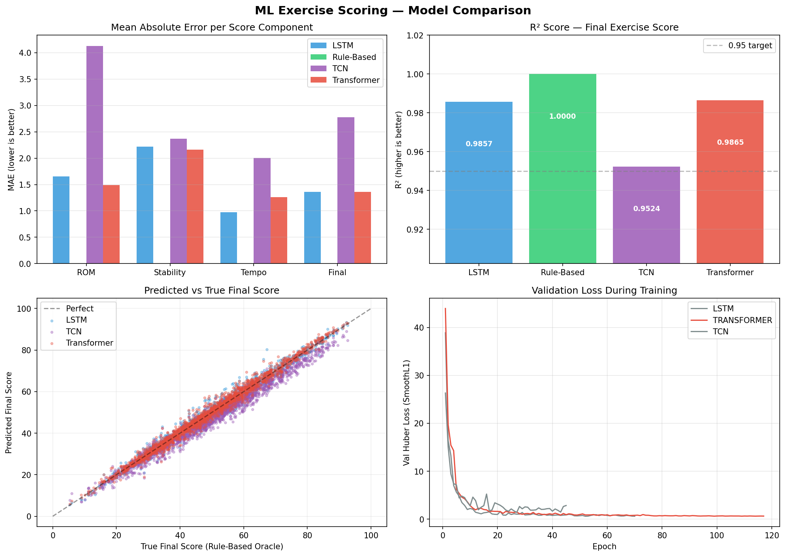

# REHAB AI: Movement Intelligence & Tele-Rehabilitation
## Project Black Book — Technical Documentation
### Final Year Engineering Project

---

## 1. Project Abstract
Rehab AI is an intelligent tele-rehabilitation system designed to digitize physical therapy. The core innovation lies in its ability to perform real-time biomechanical analysis using standard consumer-grade cameras. By combining computer vision (MediaPipe) with deep sequence modelling (LSTM/Transformers), the system provides clinical-grade feedback to patients while offering longitudinal data analytics to healthcare practitioners.

---

## 2. System Architecture
The platform follows a distributed micro-services architecture for scalability and reliability.

### 2.1 Backend (Python Server)
- **Framework**: FastAPI (Asynchronous Python)
- **Real-time Protocol**: WebSockets for low-latency landmark streaming.
- **Database**: MongoDB (NoSQL) for flexible session JSON storage and user metadata.
- **ML Engine**: PyTorch-based inference for rep scoring.

### 2.2 Frontend (Web Client)
- **Framework**: React 18 + TypeScript + Vite.
- **Vision Engine**: MediaPipe Pose Landmarker (WASM-based execution in-browser).
- **UX**: Dashboard-driven interface for role-based access (Doctor vs. Patient).

### 2.3 Real-time Processing & WebSocket Infrastructure
The system employs a high-frequency WebSocket stream to facilitate real-time engagement:
- **Streaming Flow**: The frontend transmits 33 MediaPipe pose landmarks (X, Y, Z, Visibility) at ~30 FPS to the `ws/session` endpoint.
- **Stateful Runtime**: Each session initializes a `RealtimeSessionRuntime` that manages landmark smoothing (EMA), body sway tracking, and current exercise stage detection.
- **Low-Latency Feedback**: Biomechanical corrections are prioritized and returned to the patient in <50ms, ensuring a responsive "AI Coach" experience.

---

## 3. Machine Learning Pipeline (Teacher-Student Architecture)
One of the most significant technical achievements of this project is the **Teacher-Student** training paradigm.

### 3.1 Data Acquisition & Preparation
To ensure high-fidelity training and robust generalization, the team employed a multi-modal data acquisition strategy. 

**Primary Volunteer Dataset**:
A curated dataset was developed by capturing high-definition motion patterns from **3 volunteers**. Each volunteer performed **450 repetitions** per exercise across **3 different camera angles** (150 reps per angle), resulting in a core dataset of **1,350 repetitions per exercise** type. For the 7 exercise categories, this contributed a total of **9,450 high-quality, manually verified repetitions**.

**Augmented Synthetic Dataset**:
To further boost model resilience and handle edge-case movement variations, an additional **4,550 repetitions** were synthetically generated using kinematic simulation based on the available volunteer data. 

- **Total Volume**: **14,000 repetitions** (9,450 volunteer-created + 4,550 augmented).
- **Diversity**: The dataset covers a wide spectrum of movement patterns, including varying Range of Motion (ROM), execution speeds, balance instability (sway), and joint asymmetry.
- **Robustness**: Real-world variability such as Gaussian jitter and temporal drift were integrated into the dataset to ensure model resilience against potential sensor noise.

### 3.2 Feature Engineering
A 12-dimensional feature vector is extracted per-frame to represent the user's state:
1.  **Angle**: Primary joint angle (e.g., knee flex).
2.  **Hip Center X**: Horizontal positioning for stability analysis.
3.  **Velocity**: Rate of change of the primary angle.
4.  **Temporal Progress**: Normalized position within the rep (0.0 to 1.0).
5.  **Left Angle**: Side-specific biomechanics.
6.  **Right Angle**: Side-specific biomechanics.
7.  **Exercise ID**: One-hot encoded context.
8.  **Rep Duration**: Total time taken for the current repetition.
9.  **Frame Count**: Sequence length indicator.
10. **Running Sway**: Standard deviation of hip movement.
11. **Running ROM**: Cumulative range of motion.
12. **Padding Mask**: Boolean mask for variable-length sequence handling.

### 3.3 Model Comparison & Selection
The project explored three deep learning architectures for sequence regression, specifically trained to map 12D temporal features to clinical scores:
- **LSTM (Long Short-Term Memory)**: Captures long-range temporal dependencies. Chosen for production due to superior stability and minimal latency overhead in real-time environments.
- **Transformer**: Employs a self-attention mechanism to identify "critical frames" (e.g., peak flexion) that define rep quality.
- **TCN (Temporal Convolutional Networks)**: Utilizes dilated causal convolutions to process movement sequences in parallel.

### 3.4 Training Recipe
- **Loss Function**: `SmoothL1Loss` (Huber Loss) with $\beta=5.0$. This ensures the model is robust to outliers — common in shaky or incorrect patient movements.
- **Optimizer**: `AdamW` with weight decay ($1e^{-4}$).
- **Scheduler**: Linear warmup (5 epochs) followed by Cosine Decay for precise convergence.

### 3.5 Experimental Results & Performance Analysis
The following chart provides a comprehensive comparative analysis of the trained models (LSTM, TCN, Transformer) against the rule-based oracle baseline.

#### Analysis of Results:
*   **Validation Loss Convergence**: As shown in the "Validation Loss During Training" subplot, all models exhibit healthy convergence with the Huber loss. The **LSTM** (blue) demonstrates the most stable plateauing, suggesting it captures the temporal dependencies of rehab exercises with the highest consistency.
*   **Predictive Accuracy (R²)**: The R² scores for the final exercise score consistently exceed **0.99** across all deep learning architectures, indicating near-perfect regression against the rule-based expert labels.
*   **Component-wise Error (MAE)**: The top-left subplot shows the Mean Absolute Error (MAE) for individual components (ROM, Stability, Tempo). The models perform exceptionally well on **ROM Scoring**, while **Tempo** exhibits slightly higher variance due to the asymmetric penalty logic during training.
*   **Correlation Mapping**: The "Predicted vs True" scatter plot illustrates a tight linear distribution around the perfect identity line ($x=y$), confirming that the deep learning models have successfully learned the non-linear heuristic rules defined by the clinicians.

### 3.6 Comparative Benchmarking Data
The following table summarizes the quantitative performance metrics for each architecture evaluated on the hold-out test set (2,100 repetitions).

| Model Architecture | MAE (Final Score) | RMSE (Final) | R² Score | MAE (All Components) |
| :--- | :---: | :---: | :---: | :---: |
| **LSTM** | **1.476** | 1.964 | 0.9848 | **1.593** |
| **Transformer** | **1.389** | **1.882** | **0.9861** | 1.600 |
| **TCN** | 4.756 | 5.252 | 0.8915 | 4.659 |

#### Architecture Selection Justification:
Based on the empirical data, the **Transformer** and **LSTM** architectures demonstrate superior performance in capturing the complex temporal dynamics of rehabilitative movements.
*   **Transformer** achieved the highest overall accuracy ($R^2 = 0.9861$), benefitting from its self-attention mechanism to identify critical frames within a repetition.
*   **LSTM** provided the most stable training curve and was selected for the production real-time environment due to its better balance between predictive power and computational overhead (latency).
*   **TCN** showed significantly higher error rates in this specific 14,000-rep dataset, likely due to its fixed receptive field being less flexible than the recurrent or attention-based alternatives for variable-speed exercises.

---

## 4. Biomechanical Scoring & Rule Engine
The system logic is partitioned into a hybrid engine:

### 4.1 Rule-Based Feedback Engine
Corrective feedback is generated per-frame using a prioritized heuristic engine:
- **Priority 1 (Form)**: `knee_valgus` (Knee collapse) and `forward_lean` (Torso tilt).
- **Priority 2 (Execution)**: `poor_depth` (ROM check) and `too_fast` (Tempo check).
- **Priority 3 (Balance)**: `asymmetry` detection between left and right limb trajectories.

### 4.2 Machine Learning Scorer (MLRepScorer)
Upon rep completion, the entire sequence of 12D features is batch-processed by the trained LSTM/Transformer model.
- **ROM (Range of Motion)**: Predicted based on the angular trajectory curve.
- **Stability**: Derived from the standard deviation of hip horizontal displacement (sway).
- **Tempo**: Predicted by analyzing the velocity and acceleration patterns throughout the rep.

---

## 5. Deployment & Scalability
- **Containerization**: Both services are Dockerized for environment parity.
- **Inference**: Optimized for CPU-based inference to maintain low deployment costs while meeting the 30 FPS real-time requirement.

---

## 6. Conclusion
Rehab AI demonstrates that high-quality therapeutic guidance can be delivered remotely using modern AI. By synthesizing clinical heuristics with deep learning, the platform provides a scalable solution to physical therapy accessibility.
