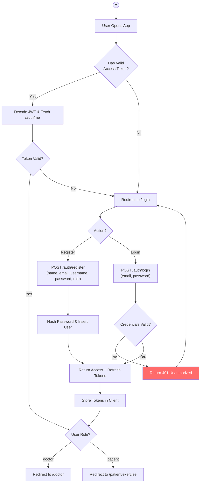
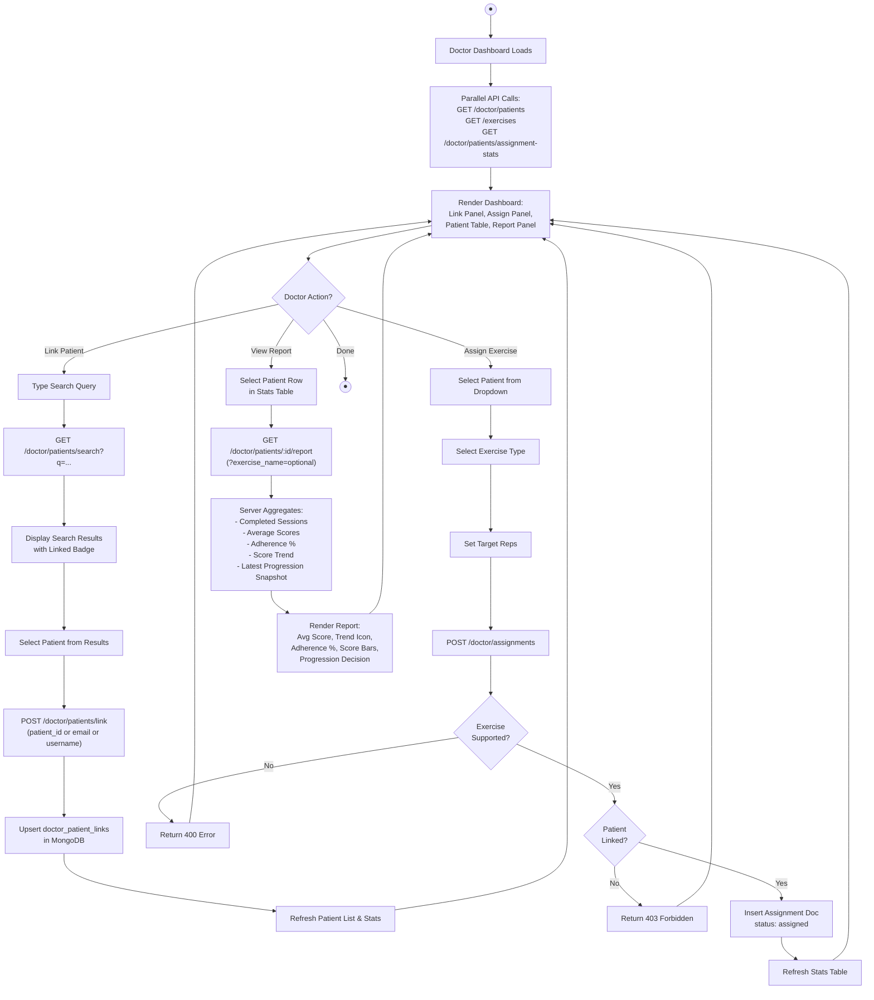
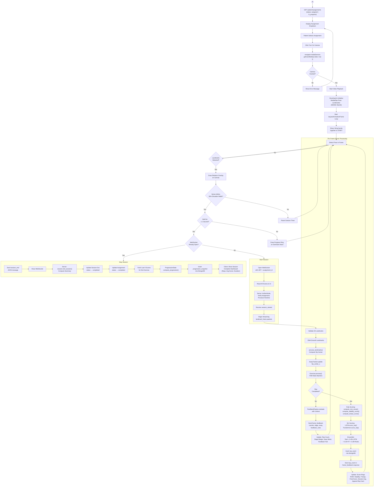
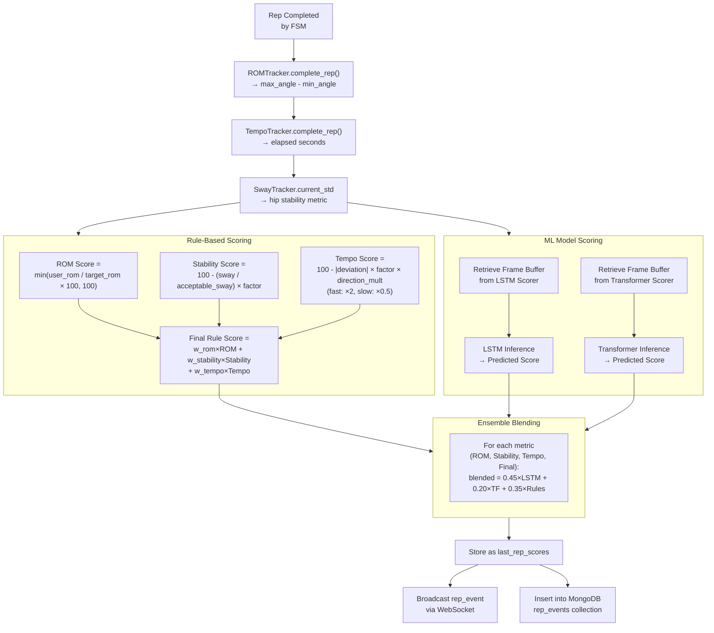
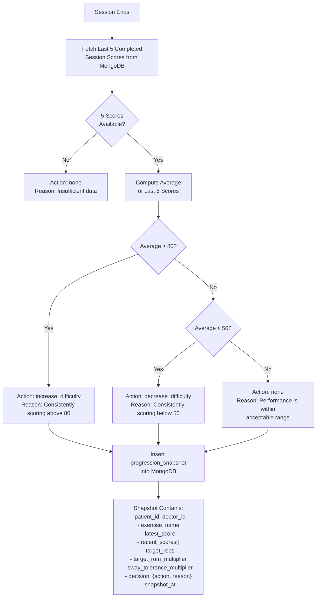
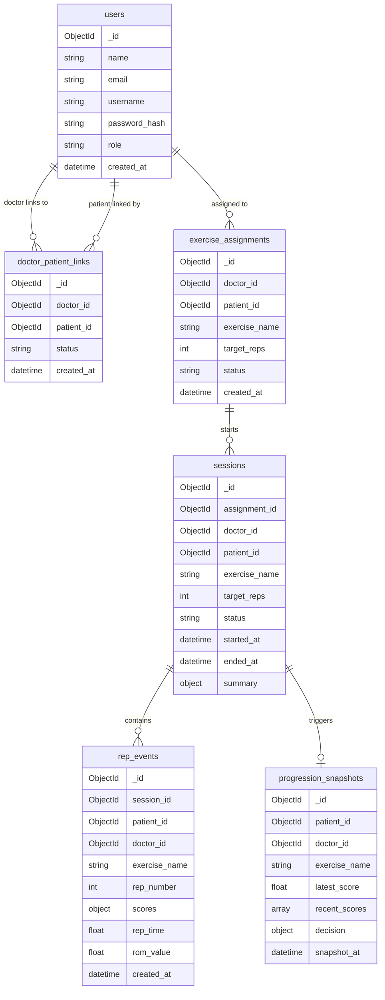

# Rehab AI — Activity Diagrams

> **Scope:** Current production architecture only — React (Vite + TypeScript) web client, FastAPI Python server, MongoDB persistence.  
> The legacy Tkinter desktop UI (`app.py`) is **deprecated** and excluded from these diagrams.

---

## 1. Top-Level System Activity Diagram

This diagram shows the complete lifecycle of the application from the perspective of **both actors** (Doctor & Patient) and the **system** (Server + Database).

```mermaid
flowchart TD
    Start((●)) --> Auth{User Role?}

    Auth -- Doctor --> D_Login[Doctor Logs In]
    Auth -- Patient --> P_Login[Patient Logs In]

    %% ===================== DOCTOR SWIMLANE =====================
    subgraph DoctorFlow["🩺 Doctor Flow"]
        D_Login --> D_Dashboard[Access Doctor Dashboard]
        D_Dashboard --> D_Choice{Action?}

        D_Choice --> D_Link[Search & Link Patient]
        D_Choice --> D_Assign[Create Exercise Assignment]
        D_Choice --> D_Report[View Patient Report]

        D_Link --> D_Search[Search by Name / Email / Username]
        D_Search --> D_LinkAPI["POST /doctor/patients/link"]
        D_LinkAPI --> D_Dashboard

        D_Assign --> D_SelectPatient[Select Linked Patient]
        D_SelectPatient --> D_SelectExercise[Select Exercise & Target Reps]
        D_SelectExercise --> D_AssignAPI["POST /doctor/assignments"]
        D_AssignAPI --> D_Dashboard

        D_Report --> D_SelectReport[Select Patient]
        D_SelectReport --> D_ReportAPI["GET /doctor/patients/:id/report"]
        D_ReportAPI --> D_ViewReport[View Avg Score, Trend,\nAdherence %, Progression]
        D_ViewReport --> D_Dashboard
    end

    %% ===================== PATIENT SWIMLANE =====================
    subgraph PatientFlow["🏃 Patient Flow"]
        P_Login --> P_Choice{Action?}

        P_Choice --> P_Exercise[Exercise Session]
        P_Choice --> P_Progress[View My Progress]

        P_Progress --> P_ProgressAPI["GET /patient/progress\nGET /patient/sessions"]
        P_ProgressAPI --> P_ViewProgress[View Avg Score, Trend,\nAdherence, Session History]
        P_ViewProgress --> P_Choice

        P_Exercise --> P_FetchAssignments["GET /patient/assignments"]
        P_FetchAssignments --> P_SelectAssignment[Select Assignment]
        P_SelectAssignment --> P_Camera[Turn On Camera]
        P_Camera --> P_InitMP[Initialize Browser MediaPipe\nWASM Pose Landmarker]
        P_InitMP --> P_DetectionLoop[Start Pose Detection Loop]
        P_DetectionLoop --> P_GestureWait{"Hands Together\nGesture ≥ 1s?"}
        P_GestureWait -- No --> P_DetectionLoop
        P_GestureWait -- Yes --> P_StartSession[Start WebSocket Session]
    end

    %% ===================== SESSION SWIMLANE =====================
    subgraph SessionFlow["⚡ Real-Time Exercise Session"]
        P_StartSession --> WS_Connect["WS /ws/session\n?token=JWT&assignment_id=ID"]
        WS_Connect --> WS_Auth{Server:\nAuthenticate JWT &\nVerify Assignment}
        WS_Auth -- Invalid --> WS_Error[Send Error & Close]
        WS_Auth -- Valid --> WS_Provision[Provision\nRealtimeSessionRuntime]
        WS_Provision --> WS_SessionDoc[Insert Session Doc\ninto MongoDB]
        WS_SessionDoc --> WS_Started["Send session_started\npacket to Client"]
        WS_Started --> FrameLoop

        subgraph FrameLoop["🔁 Frame Processing Loop"]
            FL_Capture[Capture Video Frame] --> FL_MediaPipe[Browser MediaPipe:\nExtract 33 Landmarks]
            FL_MediaPipe --> FL_DrawOverlay[Draw Skeleton Overlay\non Canvas]
            FL_MediaPipe --> FL_Send["Send landmark_frame\nJSON over WebSocket"]

            FL_Send --> BE_Smooth[EMA Landmark Smoother]
            BE_Smooth --> BE_Process[Process Landmarks\n& Compute Hip Center]
            BE_Process --> BE_Sway[Sway & Stability Tracking]
            BE_Sway --> BE_FSM[Exercise FSM\nState Tracking]
            BE_FSM --> BE_RepCheck{Repetition\nCompleted?}

            BE_RepCheck -- No --> BE_Feedback[Feedback Engine\nEvaluation]
            BE_Feedback --> FL_FeedbackSend["Send frame_feedback\nto Client"]
            FL_FeedbackSend --> FL_UpdateUI[Update Feedback Text,\nStage Badge, Sway Meter]
            FL_UpdateUI --> FL_GestureCheck{"Stop Gesture\nor Target Reached?"}
            FL_GestureCheck -- No --> FL_Capture
            FL_GestureCheck -- Yes --> SessionEnd

            BE_RepCheck -- Yes --> BE_RuleScore[Rule-Based Scoring:\nROM, Stability, Tempo]
            BE_RuleScore --> BE_MLScore[ML Inference:\nLSTM + Transformer]
            BE_MLScore --> BE_Ensemble["Ensemble Blend:\n45% LSTM + 20% TF + 35% Rules"]
            BE_Ensemble --> BE_RepDB[Insert rep_event\ninto MongoDB]
            BE_RepDB --> BE_RepSend["Send rep_event\nin frame_feedback"]
            BE_RepSend --> FL_UpdateScores[Update Score Rings,\nRep History Cards,\nSession Average]
            FL_UpdateScores --> FL_GestureCheck
        end
    end

    %% ===================== POST-SESSION =====================
    subgraph PostSession["📊 Post-Session"]
        SessionEnd[Stop Session &\nClose WebSocket] --> PS_Finalize[Finalize Session Summary\non Server]
        PS_Finalize --> PS_UpdateDB[Update Session Doc\nin MongoDB as completed]
        PS_UpdateDB --> PS_MarkAssignment[Mark Assignment\nas completed]
        PS_MarkAssignment --> PS_FetchScores[Fetch Last 5\nSession Scores]
        PS_FetchScores --> PS_Progression[Progression Engine:\nCompute Decision]
        PS_Progression --> PS_ProgressionDB[Insert Progression\nSnapshot into MongoDB]
        PS_ProgressionDB --> PS_ClientSummary[Show Session Complete\nDashboard on Client]
        PS_ClientSummary --> P_Choice
    end

    WS_Error --> P_Choice
```



---

## 2. Authentication & Authorization Activity



---

## 3. Doctor Workflow Activity



---

## 4. Patient Exercise Session — Detailed Activity



---

## 5. Patient Progress View Activity

```mermaid
flowchart TD
    A((●)) --> B[Patient Navigates to\n/patient/progress]
    B --> C["Parallel Fetch:\nGET /patient/progress\nGET /patient/sessions"]

    C --> D["Server Computes:\n- All Completed Sessions\n- Average Final Score\n- Trend Label (improving/stable/declining)\n- Adherence % (completed / total assignments)\n- Latest Progression Snapshot"]

    D --> E[Render Progress Dashboard]

    E --> F[Stat Cards:\nAvg Score | Trend | Adherence | Sessions]
    E --> G[Recent Scores Bar Chart]
    E --> H[Progression Decision:\nAction + Reason]
    E --> I[Session History List:\nExercise, Date, Score, Reps, Status]
```

---

## 6. Scoring Pipeline — Internal Activity



---

## 7. AI Progression Engine Activity



---

## 8. Supported Exercises

The system currently supports **10 exercises**, each with a custom FSM and `ExerciseConfig`:

| Exercise | FSM Tracking | Key Metric |
|---|---|---|
| Squats | Hip-to-knee vertical distance | Depth ROM |
| Sit To Stand | Seated ↔ Standing transitions | Verticality |
| Heel Raises | Ankle elevation | Calf ROM |
| Standing Hip Abduction | Lateral leg angle | Abduction ROM |
| Standing Hip Extension | Backward leg angle | Extension ROM |
| Leg Raises | Forward leg elevation | Flexion ROM |
| Marching | Alternating knee lifts | Bilateral tracking |
| Forward Arm Raises | Shoulder flexion angle | Arm ROM |
| Side Arm Raises | Shoulder abduction angle | Arm ROM |
| Wall Push-ups | Elbow angle changes | Push-up depth |

---

## 9. MongoDB Collections Used


