```mermaid
flowchart TD
    Start(("● Start"))

    Start --> A1

    %% ==================== COLUMN 1: Patient & Doctor Auth ====================
    subgraph AuthBlock["Patient & Doctor Authentication"]
        direction TB
        A1["• User Opens Web Application"]
        A2["• Login via Email & Password\n  POST /auth/login"]
        A3["• Server Validates Credentials\n  & Returns JWT Tokens"]
        A4{"Role-Based\nRouting"}
        A1 --> A2 --> A3 --> A4
    end

    A4 -- "role = doctor" --> D1
    A4 -- "role = patient" --> P1

    %% ==================== DOCTOR FLOW ====================
    subgraph DoctorBlock["Doctor Dashboard Module"]
        direction TB
        D1["• Access Doctor Dashboard\n  /doctor"]
        D2["• Search & Link Patients\n  by Name / Email / Username\n  POST /doctor/patients/link"]
        D3["• Assign Exercise to Patient\n  Select Exercise Type & Target Reps\n  POST /doctor/assignments"]
        D4["• View Patient Overview Table\n  GET /doctor/patients/assignment-stats\n  Filter by Name / Email"]
        D5["• View Patient Report\n  GET /doctor/patients/:id/report\n  Avg Score, Trend, Adherence %,\n  Score History, Progression Decision"]
        D1 --> D2 --> D3 --> D4 --> D5
    end

    D5 -.->|"Assignments appear\nin Patient's list"| P1

    %% ==================== PATIENT ENTRY ====================
    subgraph PatientEntry["Patient Session Initialization"]
        direction TB
        P1["• Patient Logs into\n  Web Application /patient"]
        P2["• Fetch Active Assignments\n  GET /patient/assignments"]
        P3["• Select Exercise Assignment\n  from Dropdown"]
        P4["• Click Turn On Camera\n  navigator.mediaDevices.getUserMedia"]
        P5["• Initialize MediaPipe Pose\n  Detection WASM in Browser\n  (pose_landmarker_lite, float16)"]
        P6["• Detect Gesture-Based\n  'Start' Signal\n  (Hands Together ≥ 1 Second)"]
        P7["• Establish Secure WebSocket\n  Connection with JWT Auth\n  WS /ws/session?token=...&assignment_id=..."]
        P1 --> P2 --> P3 --> P4 --> P5 --> P6 --> P7
    end

    P7 --> L1
    P7 --> B1

    %% ==================== CLIENT-SIDE LANDMARK PROCESSING ====================
    subgraph LandmarkBlock["Real-Time Landmark Processing (Client)"]
        direction TB
        L1["• Capture Live Video\n  Frames via Camera"]
        L2["• Detect 33 3D Pose\n  Landmarks Using\n  MediaPipe WASM"]
        L3["• Overlay Skeletal\n  Visualization on\n  Live Video Canvas"]
        L4["• Stream Pose Landmarks\n  (X, Y, Z, Visibility)\n  at ~30 FPS Over WebSocket"]
        L1 --> L2 --> L3 --> L4
    end

    L4 --> S1

    %% ==================== BACKEND SESSION MANAGEMENT ====================
    subgraph SessionBlock["Backend Session Management"]
        direction TB
        B1["• Authenticate WebSocket\n  Connection via JWT"]
        B2["• Verify Patient Assignment\n  exists & is active in MongoDB"]
        B3["• Initialize\n  RealtimeSessionRuntime\n  for requested Exercise"]
        B4["• Insert Session Document\n  into MongoDB\n  status: in_progress"]
        B5["• Send session_started\n  packet to Client"]
        B1 --> B2 --> B3 --> B4 --> B5
    end

    %% ==================== SERVER PIPELINE ====================
    subgraph PipelineBlock["Server-Side Processing Pipeline"]
        direction TB
        S1["• Validate & Parse\n  33 Landmark Coordinates"]
        S2["• Smooth Landmarks Using\n  EMA Exponential Moving\n  Average Smoother (α=0.3)"]
        S3["• Compute Hip Center\n  process_landmarks()"]
        S1 --> S2 --> S3
    end

    S3 --> BM1
    S3 --> F1

    %% ==================== BIOMECHANICAL ANALYSIS ====================
    subgraph BioBlock["Biomechanical Analysis Module"]
        direction TB
        BM1["• Track Sway Between\n  Left and Right Hips\n  SwayTracker (window=30)"]
        BM2["• FSM-Based Exercise\n  Stage Detection\n  (e.g., up ↔ down states)"]
        BM3["• Track ROM via ROMTracker\n  & Tempo via TempoTracker"]
        BM4{"Repetition\nCompleted?"}
        BM5["• Analyze Landmark Sequences\n  to Grade ROM, Tempo,\n  Stability per Rep"]
        BM6["• ML Model Inference\n  LSTM Scorer + Transformer\n  Scorer on Frame Buffer"]
        BM7["• Ensemble Score Aggregation\n  45% LSTM + 20% Transformer\n  + 35% Rule-Based"]
        BM1 --> BM2 --> BM3 --> BM4
        BM4 -- "Yes" --> BM5 --> BM6 --> BM7
    end

    BM4 -- "No" --> F1
    BM7 --> PA1
    BM7 --> F1

    %% ==================== FEEDBACK GENERATION ====================
    subgraph FeedbackBlock["Feedback Generation"]
        direction TB
        F1["• Real-Time Feedback Engine\n  Evaluate Sway, ROM Depth,\n  Rep Speed per Frame"]
        F2["• Stream frame_feedback\n  Payload via WebSocket\n  (counter, stage, sway,\n  feedback_rules, rep_event)"]
        F3["• Client Updates UI:\n  Rep Count, Stage Badge,\n  Sway Meter, Score Rings,\n  Rep History Cards"]
        F1 --> F2 --> F3
    end

    F3 -->|"Next Frame"| L1

    %% ==================== PROGRESSION & ANALYTICS ====================
    subgraph ProgressBlock["Progression & Analytics Module"]
        direction TB
        PA1["• Log Rep Event with\n  Scores in MongoDB\n  (rep_events collection)"]
        PA2["• On Session End:\n  Finalize Session Summary\n  (Avg Scores, Duration, Total Reps)"]
        PA3["• Update Session & Assignment\n  status → completed in MongoDB"]
        PA4["• AI Progression Engine:\n  Analyze Last 5 Session Scores\n  avg ≥ 80 → increase_difficulty\n  avg ≤ 50 → decrease_difficulty"]
        PA5["• Store Progression Snapshot\n  in MongoDB\n  (decision, multipliers, scores)"]
        PA6["• Display Final Summary\n  Stats to Patient\n  (Reps, Avg Score, Duration)"]
        PA1 --> PA2 --> PA3 --> PA4 --> PA5 --> PA6
    end

    PA6 --> PatientProgress

    %% ==================== PATIENT PROGRESS VIEW ====================
    subgraph PatientProgress["Patient Progress Dashboard"]
        direction TB
        PP1["• View My Progress\n  /patient/progress"]
        PP2["• Fetch Progress & Sessions\n  GET /patient/progress\n  GET /patient/sessions"]
        PP3["• Display: Avg Score,\n  Trend (📈📉➡️),\n  Adherence %, Session Count"]
        PP4["• Recent Scores Bar Chart\n  & Session History List"]
        PP5["• Latest Progression\n  Decision & Reason"]
        PP1 --> PP2 --> PP3 --> PP4 --> PP5
    end

    %% ==================== STREAMING LOOP ANNOTATION ====================
    subgraph StreamingLoop["High-Speed Streaming Loop (~30 FPS)"]
        direction LR
        SL1["• Stream Landmark Payload\n  via WebSocket"]
        SL2["• Receive frame_feedback\n  from Backend"]
        SL1 --> SL2
    end

    L4 -.-> SL1
    SL2 -.-> F3

    %% ==================== STYLING ====================
    classDef blueBlock fill:#dce6f5,stroke:#4a7ab5,color:#1a3a5c,font-weight:bold
    classDef lightBlueBlock fill:#e3f0fa,stroke:#5ba3d9,color:#1a3a5c,font-weight:bold
    classDef greenBlock fill:#d9eddb,stroke:#4a9b52,color:#1a3c1f,font-weight:bold
    classDef orangeBlock fill:#fce4cc,stroke:#d4883a,color:#5c3310,font-weight:bold
    classDef yellowBlock fill:#fef9d9,stroke:#c4a93a,color:#5c4a10,font-weight:bold
    classDef tealBlock fill:#d4f0eb,stroke:#3a9b8f,color:#1a3c36,font-weight:bold
    classDef purpleBlock fill:#e8dff5,stroke:#7b5ea3,color:#3a1a5c,font-weight:bold
    classDef grayBlock fill:#f0f0f0,stroke:#888,color:#333,font-weight:bold

    class AuthBlock blueBlock
    class DoctorBlock purpleBlock
    class PatientEntry blueBlock
    class LandmarkBlock lightBlueBlock
    class SessionBlock greenBlock
    class PipelineBlock greenBlock
    class BioBlock orangeBlock
    class FeedbackBlock tealBlock
    class ProgressBlock yellowBlock
    class PatientProgress lightBlueBlock
    class StreamingLoop grayBlock
```

# Rehab AI — Comprehensive Activity Diagram

> **Scope:** Current production architecture — React (Vite + TypeScript) web client, FastAPI Python server, MongoDB.  
> The legacy Tkinter desktop UI (`app.py`) is **deprecated** and excluded.

---

---

### Module Legend

| Color | Module | Description |
|---|---|---|
| 🔵 Blue | **Authentication & Patient Init** | Login, JWT auth, camera setup, MediaPipe init, gesture activation |
| 🟣 Purple | **Doctor Dashboard** | Link patients, assign exercises, view reports & progression |
| 🔷 Light Blue | **Real-Time Landmark Processing** | Client-side MediaPipe WASM, skeleton overlay, landmark streaming |
| 🟢 Green | **Backend Session Management** | WebSocket auth, runtime provisioning, EMA smoothing pipeline |
| 🟠 Orange | **Biomechanical Analysis** | Sway tracking, FSM state detection, ROM/Tempo grading, ML ensemble scoring |
| 🟦 Teal | **Feedback Generation** | Per-frame feedback engine, WebSocket broadcast, UI updates |
| 🟡 Yellow | **Progression & Analytics** | Rep logging, session summary, AI progression engine, MongoDB persistence |
| ⬜ Gray | **Streaming Loop** | Continuous ~30 FPS bidirectional WebSocket data exchange |

### Supported Exercises (10)

| Exercise | FSM Tracking | Key Metric |
|---|---|---|
| Squats | Hip-knee vertical distance | Depth ROM |
| Sit To Stand | Seated ↔ Standing | Verticality |
| Heel Raises | Ankle elevation | Calf ROM |
| Hip Abduction | Lateral leg angle | Abduction ROM |
| Hip Extension | Backward leg angle | Extension ROM |
| Leg Raises | Forward leg elevation | Flexion ROM |
| Marching | Alternating knee lifts | Bilateral |
| Forward Arm Raises | Shoulder flexion | Arm ROM |
| Side Arm Raises | Shoulder abduction | Arm ROM |
| Wall Push-ups | Elbow angle | Push-up depth |

### MongoDB Collections

| Collection | Purpose |
|---|---|
| `users` | Doctor & patient accounts with hashed passwords |
| `doctor_patient_links` | Doctor-patient relationship mapping |
| `exercise_assignments` | Prescribed exercises with target reps |
| `sessions` | Exercise session records with summaries |
| `rep_events` | Individual rep scores & metrics |
| `progression_snapshots` | AI-generated difficulty adjustment decisions |
