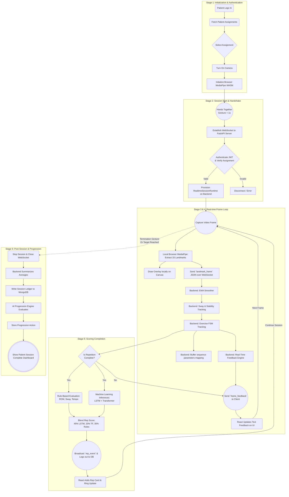

# Rehab AI Application Workflow

This document provides a clear, step-by-step technical explanation of how the Rehab AI application operates, utilizing a distributed architecture between the React web client and the FastAPI Python server.

---

## Stage 1: Initialization & Authentication

1. **Patient Login & Assignment:** The patient logs into the web application. The React client calls the backend API to fetch their personalized `assignments` prescribed by their doctor (e.g., "Sit To Stand — 10 reps").
2. **Device Setup:** The user selects an assignment and clicks "Turn On Camera". The browser requests permission to access the webcam via JavaScript `navigator.mediaDevices.getUserMedia`. 
3. **Local AI Initialization:** A lightweight WebAssembly (WASM) version of Google's **MediaPipe Pose Detection** model (`pose_landmarker_lite`) is downloaded and initialized directly inside the user's browser for extreme low-latency processing.

---

## Stage 2: Session Start & Handshake

1. **Gesture Activation:** The user stands back from the camera and brings their hands together (wrists touching). The frontend tracks this specific gesture for 1 second to trigger the "START" action without requiring a physical mouse click.
2. **WebSocket Connection:** The React client establishes a secure WebSocket connection to the Python backend (`/ws/session`), authenticating via JWT. 
3. **Backend Session Provisioning:** The server authenticates the token, verifies the assignment, provisions a `RealtimeSessionRuntime` engine in memory explicitly for the requested exercise target, and replies with a `session_started` packet.

---

## Stage 3: Real-time Frame Capture & Transport

While the session is running, a continuous high-speed loop executes recursively:

### Step 3.1: Client-Side Landmark Extraction
- The camera captures a video frame. The local browser-based MediaPipe model immediately processes it, extracting 33 distinct 3D body coordinates (landmarks) such as elbows, knees, and hips.
- *Visuals:* The React canvas continuously draws skeletal overlay lines and joints directly on top of the video feed so the user sees themselves tracked in real-time.

### Step 3.2: WebSocket Streaming
- The frontend packages the 33 extracted landmark coordinates into a highly compressed JSON payload (`landmark_frame`) and fires it across the WebSocket to the FastAPI backend.

---

## Stage 4: Backend Pipeline Processing

As the server receives the `landmark_frame` stream, the data flows through the centralized Python pipeline:

### Step 4.1: The Smoothing Engine (`EMALandmarkSmoother`)
- To prevent AI tracking jitter, the raw landmarks are piped into an **EMA (Exponential Moving Average) Smoother** on the server. This mathematically blends previous frame positions with the current ones to generate a rock-solid, stabilized motion trajectory.

### Step 4.2: Sway & Stability Tracking
- The server computes the midpoint between the left and right hips to track horizontal `sway`. Excessive leaning or loss of balance is flagged immediately.

### Step 4.3: Exercise Finite State Machine
- The exact smoothed coordinates are passed into the specific exercise logic module (e.g., `SitToStand`). 
- A Finite State Machine (FSM) tracks the vertical distances and joint angles to deduce posture. (e.g., If the hip-to-knee distance drops beneath a threshold, state = `down`/`seated`. If it rises, state = `up`/`standing`).

### Step 4.4: ML Frame Sequence Mapping
- Key data points (like hip position and skeletal angles) are recorded into a short-term memory tensor on the backend. This acts as a rolling buffer that maps the chronological trajectory of the movement.

### Step 4.5: Real-time Feedback Loop
- A Feedback Engine validates the user's instant state. If they are moving too fast or lacking depth, a text string (e.g., "Too fast, slow down!") is generated.
- The server instantly broadcasts a `frame_feedback` JSON packet back to the frontend containing the repetition count, stage, sway metric, and the feedback text. The React client updates the screen instantly.

---

## Stage 5: Scoring Completion

When the Exercise FSM detects that the user reversed their motion and successfully completed a full repetition (e.g., stood back up):

### Step 5.1: Sub-Model Evaluation
- **Rule-Based Math:** Grades exactly how deep the user went (ROM), how stable they were (Sway), and how ideal their repetition speed was (Tempo).
- **Deep Learning Inferences:** The buffered sequence history is passed into Advanced LSTM (Long Short-Term Memory) and Transformer AI models for clinical motion evaluation.

### Step 5.2: Final Blend & Broadcast
- The server calculates a final blended ensemble score (`45% LSTM` + `20% Transformer` + `35% Rules`).
- A `rep_event` is appended to the WebSocket frame package and sent to the UI. The React client updates its circular Score Rings and the Rep History log dynamically.
- The rep is safely logged in the MongoDB database (`rep_events`).

---

## Stage 6: Post-Session Analytics & Progression

1. **Session Termination:** The user repeats the "hands together" gesture to stop the session, or the target rep count is reached. The WebSocket is closed.
2. **Ledger Update:** The backend finalizes the session summary (calculating average scores and session duration) and persists it into the `sessions` collection in MongoDB.
3. **The AI Progression Engine (`ProgressionState`):** The server analyzes the patient's performance history for this exercise. If the average score consistently exceeds 80, the engine issues an automated clinical recommendation to increase the target reps or target depth for the *next* assignment.
4. **Client Summary:** The React client hides the camera view and renders an aesthetic "Session Complete" dashboard displaying their final average scores and total exercise duration.

---

## Technical Activity Flowchart

The following activity flow diagram maps out the complete lifecycle of a single session, detailing interactions between the Web Client, the FastAPI Server, and the Database.

